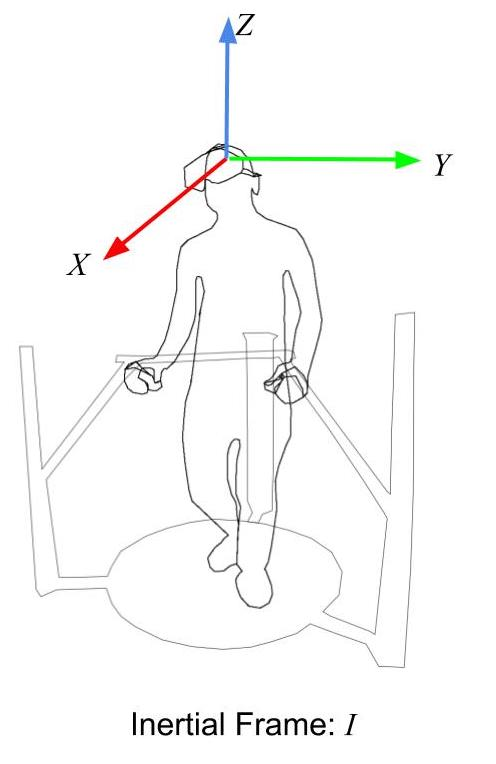
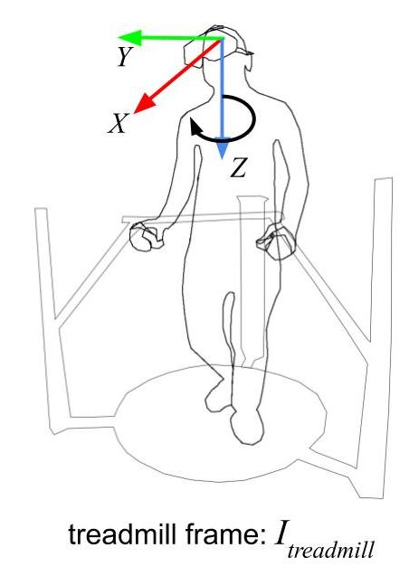
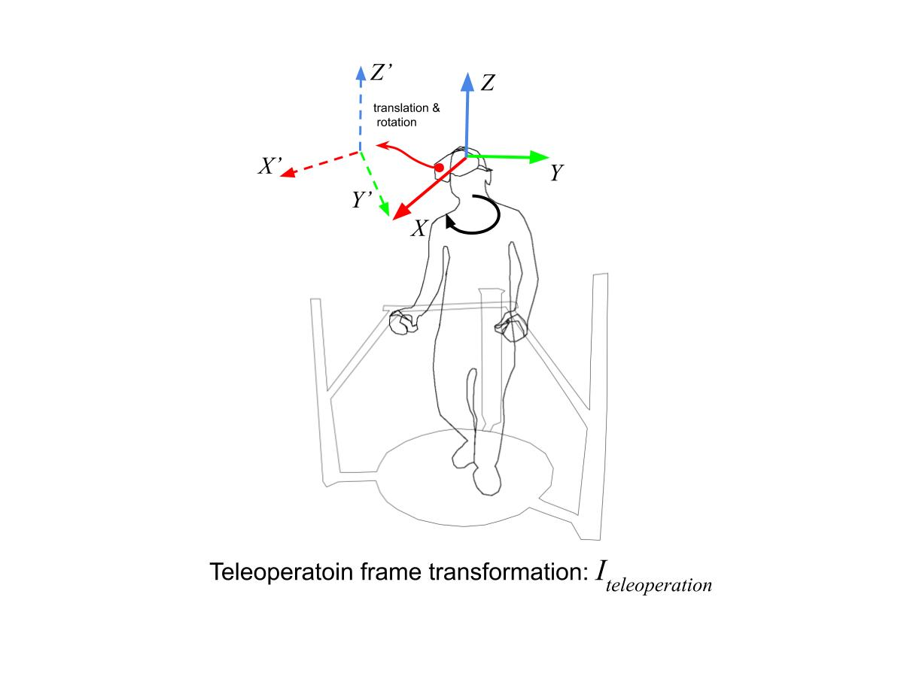
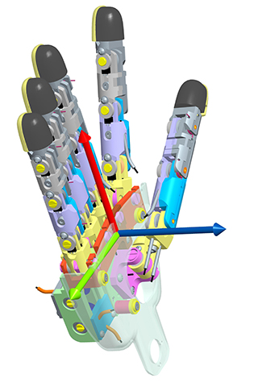
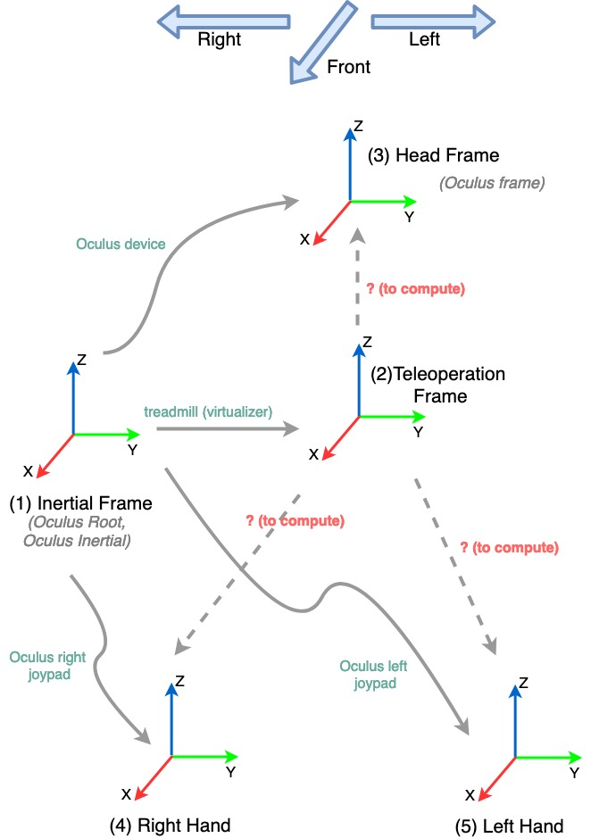

**Following you can find the descriptions of the frames used by different devices in teleoperation framework:**

## Inertial Frame

We define the inertial frame in the human side as following:

<p align="center">
  
</p>

## Oculus Device
According to the [Oculus documentation](https://developer.oculus.com/documentation/native/pc/dg-sensor/), the frames attached to the Oculus Virtual Reality (OVR) headset are as following:
```
The x-z plane is aligned with the ground regardless of camera orientation.
As seen from the diagram, the coordinate system uses the following axis definitions:
- Y is positive in the up direction.
- X is positive to the right.
- Z is positive heading backwards.
Rotation is maintained as a unit quaternion, but can also be reported in yaw-pitch-roll form. Positive rotation is counter-clockwise.
```
However, the custom they have used for defining the euler angles and their composition order are different from ours.
[Following line of code](https://github.com/robotology/walking-teleoperation/blob/master/modules/Oculus_module/src/OculusModule.cpp#L386-L389
) provides us the rotation from [inertial frame](#inertial-frame) (attached to the human head at the begning) to the oculus headset at timestep `t` expressed in preferred coordinate system:

```
iDynTree::toEigen(m_oculusRoot_T_headOculus).block(0, 0, 3, 3)
                = iDynTree::toEigen(iDynTree::Rotation::RPY(-desiredHeadOrientationVector(1),
                                                            desiredHeadOrientationVector(0),
                                                            desiredHeadOrientationVector(2)));
```                                                           

<p align="center">
  
</p>

## treadmill (Virtualizer Cyberith)

According to the measurement information we acquire from the cyberith treadmill, we identify the frame of Virtualizer as following:

<p align="center">
  
</p>

Threfore [we have:](https://github.com/robotology/walking-teleoperation/blob/60b449e6e8d5120a2a11ca2997521f46c51821c1/modules/Oculus_module/src/HeadRetargeting.cpp#L105)

```
m_oculusInertial_R_teleopFrame = iDynTree::Rotation::RotZ(-playerOrientation);
```
The rotation of the operator (called player here) inside the treadmill is defined with `playerOrientation`, and the rotation of it is expressed in preferred coordinates of the `I_treadmill`. In order to express the rotation in [inertial coordinates](#inertial-frame) (in the code is mentioned by `oculusInertial`), we perform the following transformation
```
 rotz(- playerOrientation)= rotx(pi) * rotz(playerOrientation) * rotx(-pi)
```
When the human rotates inside the virtualizer, not only he has rotation around `z` axis, but also the _teleoperaition frame_  translates as following figure shows:


<p align="center">
  
</p>

To find the translation, we assume when the human rotates, he is looking forward, and we compute the translation using the acquired oculus headset data.


# Hand Frames

The human and robot hand frames are defined similarly,i.e.,

<p align="center">
  
</p> 

What we are interested in the teleoperation scnenario is the transfromation `m_teleopRobotFrame_T_handRobotFrame`, i.e., [the transformation from the rorobt teleoperation frame to the robot hand frames](https://github.com/robotology/walking-teleoperation/blob/60b449e6e8d5120a2a11ca2997521f46c51821c1/modules/Oculus_module/src/HandRetargeting.cpp#L74-L77)
```
    m_teleopRobotFrame_T_handRobotFrame
        = m_teleopRobotFrame_T_teleopFrame * m_oculusInertial_T_teleopFrame.inverse()
          * m_oculusInertial_T_handOculusFrame * m_handOculusFrame_T_handRobotFrame;

```
- In this equation, `teleopRobotFrame` and `teleopFrame` are the frames attached to robot and human teleoperation frames. 

- In the code, the `oculusInertial` and `oculusRoot` frames are the intertial frame defined at the begining of this document.
- The teleoperation frame, is the frame that attached to the virtualizer and rotates with that. At the initial time of the teleoperation scenario, the teleoperation and inertial frame matches their location and their axes are parallel.
However, the defenition of the robot teleoperation frame is the same as [robot imu frame ](https://github.com/kouroshD/walking-teleoperation/blob/feature/updateDocs/app/robots/iCubGenova04/leftHandRetargetingParams.ini#L6-L10), and is similar to the robot `root_link` frame:
```
- The z-axis is parallel to gravity but pointing upwards.
- The x-axis points behind the robot.
- The y-axis points laterally and is chosen according to the right-hand rule.
```


## Frame Chains:

Following is the frame chain related to the perception system of the human:


<p align="center">
  
</p> 

## Xsens Suit
When using full body suit to teleoperate the robot, following are the frames attached to the human body links:


<p align="center">
  
</p> 

Following are the frames attached to the iCub body links:

<p align="center">
  
</p> 

When we do retargeting using Xsens, each of these frames of the human (where the data are coming) are transformed to the corresponding ones of the robot.

For more information regarding the correspondence of the frames you can look at [this configuration file](https://github.com/robotology/human-dynamics-estimation/blob/devel/conf/xml/RobotStateProvider_iCub.xml).

Regarding the transformation of the frames, you can find them [in this urdf file](https://github.com/robotology/human-dynamics-estimation/blob/devel/conf/urdfs/teleoperation_iCub_model_V_2_5.urdf), and the tranformation are done from the parent link (each link_name) to the child dummy link specified by `_fake`, e.g., [from `root_link` to `root_link_fake`](https://github.com/robotology/human-dynamics-estimation/blob/devel/conf/urdfs/teleoperation_iCub_model_V_2_5.urdf#L3341-L3353).


