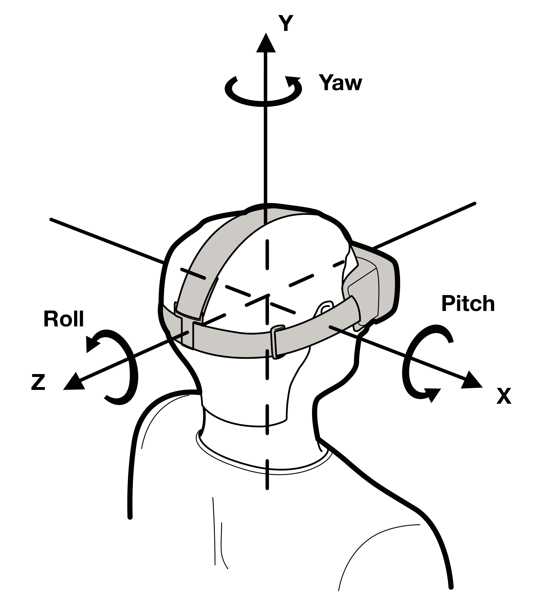
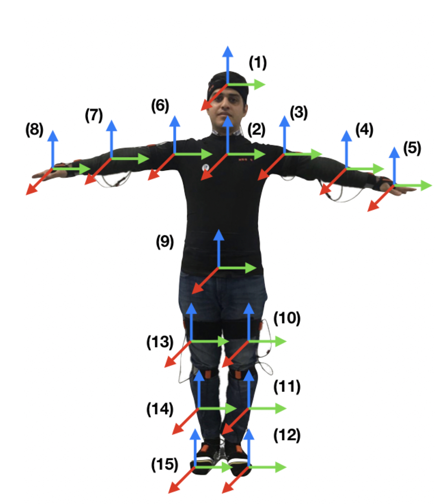
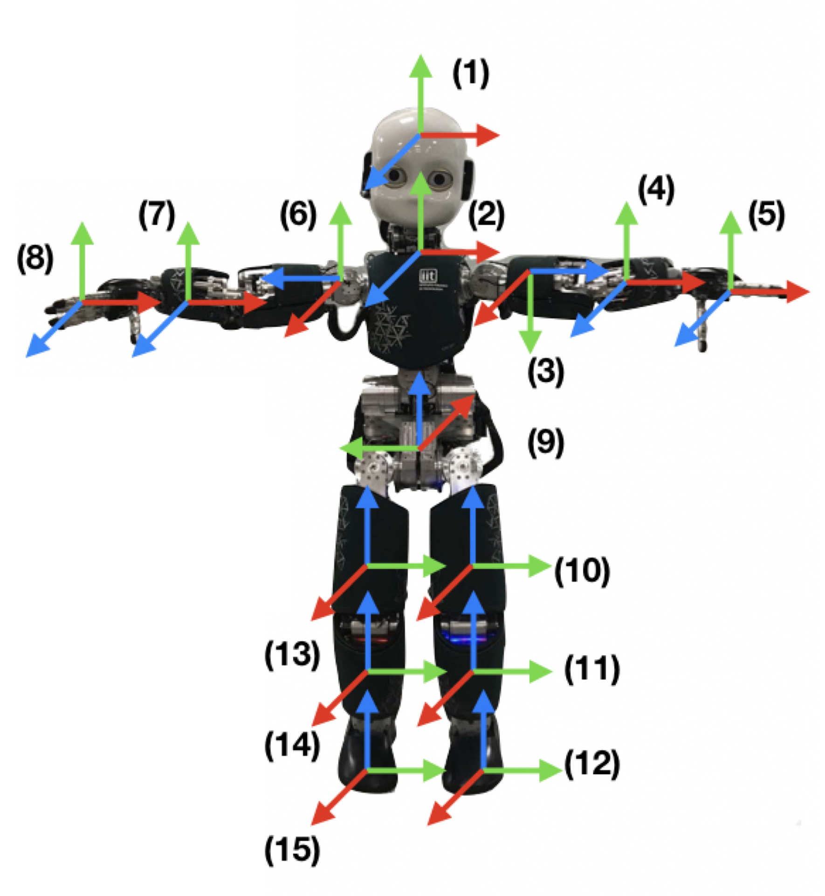

Following are the descriptions of the Frames used by different devices in our framework following these issues:

**Oculus Device**

  

**Virtualizer (treadmill)**

  

**Xsens Suit**

  

 | 

  

 
